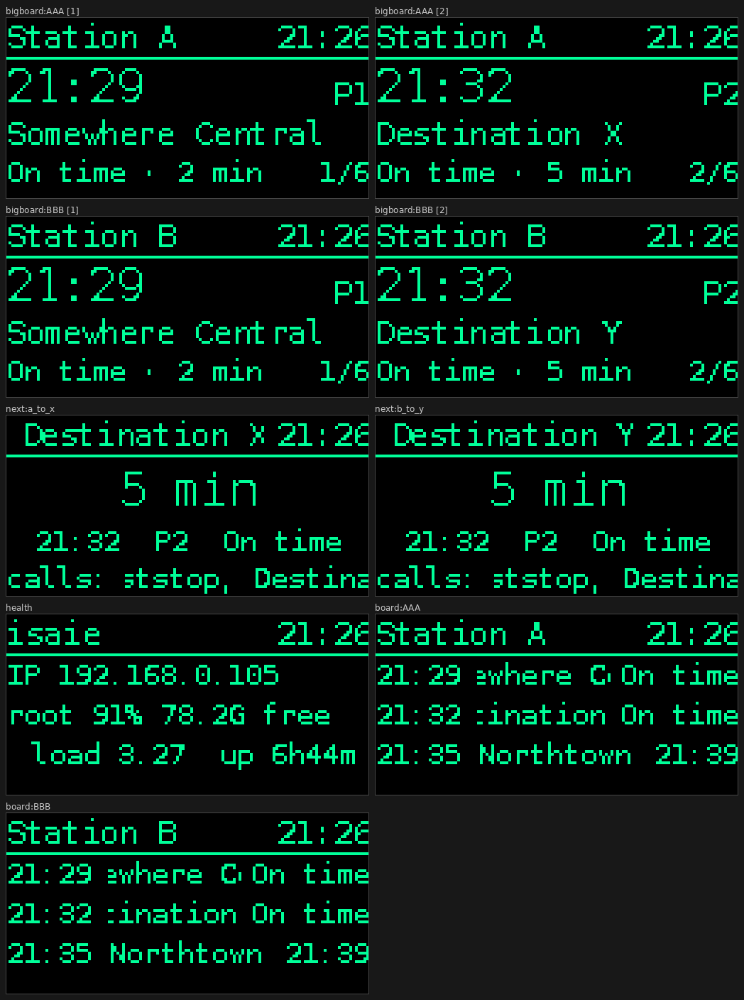

# railboard

A live UK train **departure board** for a small I2C OLED, driven from any Linux
single-board computer (built for an **ODROID HC4** running Armbian; works on a
Raspberry Pi too).

It rotates through several pages on a 128×64 OLED:

- **`bigboard`** — a large, glanceable single-station view that cycles through the
  next few departures one at a time (big time + destination). Most readable from
  across a room.
- **`next train`** pages — mirror a platform indicator for a specific journey: a
  big countdown (`6 min`), scheduled time, platform, status, and scrolling calling
  points.
- **`board`** — a packed full departure board (smaller text, several trains at once).
- **`health`** — IP address, disk usage, CPU temperature, load and uptime, so the
  display doubles as a headless-box status screen.
- **`combo`** *(optional)* — two journeys' next trains on one page.

Everything (stations, journeys, page order, fonts, timings) is driven by
`config.yaml`. Active **burn-in mitigation** is built in (pixel-shift, quiet-hours
dimming, optional invert). Data comes from the **Rail Data Marketplace** Live
Departure Board REST API (the modern replacement for the Darwin OpenLDBWS SOAP
service).

## What it looks like



_Rendered with `--display simulate --mock` (placeholder stations). Small text is
hard to read on a 128×64 panel, so the rotation leads with the large `bigboard`
and `next` pages; see the `readable preset` in `config.example.yaml` to go bigger._

---

## 1. Hardware

- An SBC with an I2C OLED wired up (SSD1306 or SH1106, 128×64).
- Find the bus and address:

  ```bash
  sudo apt install i2c-tools
  i2cdetect -y 0        # try bus 0 and 1; note the address (often 0x3c)
  i2cdetect -y 1
  ```

Set `display.driver`, `display.i2c_port`, `display.i2c_address` and `display.rotate`
in `config.yaml` to match.

> **ODROID HC4 note:** the stock OLED add-on is an **SSD1306 on I2C bus 0**, mounted
> upside-down — so `i2c_port: 0` and `rotate: 2` (the stock `sys-oled` used
> `--i2c-port 0 --rotate 2`). This repo's `config.yaml` is already set that way.

Accessing `/dev/i2c-*` needs the **`i2c` group** (the device is `root:i2c`). The
installer adds your user to it and the service also grants it via
`SupplementaryGroups=i2c`, so it works without running as root.

## 2. Get a Rail Data Marketplace API key

1. Register at <https://raildata.org.uk> and sign in.
2. In the **Product** catalogue, search for **"Live Departure Board"** and
   **Subscribe** to it. The free *open* tier is normally approved instantly.
   (You subscribe to the specific product/version you'll call — if there are
   several, pick the "Departure Board" one with details, i.e. `GetDepBoardWithDetails`.)
3. Open the product's **Specification** tab and copy two things:
   - your **Consumer key** — this is the `x-apikey` value. **Use the key, not the
     secret.**
   - the **product prefix** — the path segment right after the host in the base URL,
     e.g. `1010-live-departure-board-dep`. It varies per subscription/version, so
     set it as `api.product_prefix` in `config.yaml`.
4. Manage your keys any time under **My account → Applications / Subscriptions**.

The request the app makes:

```
GET https://api1.raildata.org.uk/<product_prefix>/LDBWS/api/20220120/GetDepBoardWithDetails/<CRS>
Header: x-apikey: <consumer key>
```

Sanity-check it before deploying (KGX = London King's Cross):

```bash
export RDM_API_KEY=your_consumer_key
curl -H "x-apikey: $RDM_API_KEY" \
  "https://api1.raildata.org.uk/<product_prefix>/LDBWS/api/20220120/GetDepBoardWithDetails/KGX"
```

A JSON body with `trainServices` means you're good.

## 3. Install on the NAS (pipx)

```bash
git clone git@github.com:davidswarbrick/odroid-hc4-railboard.git railboard
cd railboard
sudo ./install.sh
```

`install.sh` is idempotent and will:

- `apt install` any missing deps (`i2c-tools`, `pipx`),
- add your user to the **`i2c`** group,
- `pipx install .[hardware]` (pulls in `luma.oled` + `psutil`) into `/usr/local/bin`,
- install config to **`/etc/railboard/config.yaml`** (using the repo's `config.yaml`
  if present, else `config.example.yaml` — it won't clobber an existing one),
- create **`/etc/railboard/railboard.env`** for your API key,
- install and enable the systemd unit,
- print the last manual steps (add the key, disable the old `sys-oled`, start).

Then:

```bash
sudoedit /etc/railboard/railboard.env            # set RDM_API_KEY=...
sudoedit /etc/railboard/config.yaml              # check stations/journeys/display
sudo systemctl disable --now sys-oled.service    # stop the stock OLED script
sudo systemctl start railboard.service
journalctl -u railboard.service -f
```

Upgrade later with `git pull && sudo ./install.sh`.

## 4. Configure

`config.yaml` (see `config.example.yaml` for the fully-commented template):

- **stations** — CRS (3-letter) code + display name. Look codes up at
  <http://www.railwaycodes.org.uk/crs/crs0.shtm> or nationalrail.co.uk.
- **journeys** — named `origin → target` pairs for the `next`/`combo` pages.
  `match: any` counts any train that *calls at* the target (what you'd board);
  `match: destination` only counts trains terminating there.
- **pages** — the rotation. Each entry is one page:
  `bigboard:<CRS>`, `board:<CRS>`, `next:<journey id>`, `health`, `combo:<id>,<id>`.
- **display** — panel wiring (`driver`/`i2c_port`/`i2c_address`/`rotate`), timings
  (`dwell_seconds`, `bigboard_sub_dwell`, `fps`) and fonts. For bolder, more
  readable text bump `font_size`/`header_font_size`/`big_font_size` (the
  `readable preset` in the example), accepting fewer rows on the packed `board`.
- **burn_in / quiet_hours** — see below.
- **disk_paths** — `label: path` map shown on the health page (the HC4 config
  points at `/` and the RAID array mount).

## 5. Develop / preview (no hardware)

Using [uv](https://docs.astral.sh/uv/) (like the sibling `swarbs-home` project):

```bash
uv run railboard --display simulate --mock --once   # render each page to PNGs
uv run railboard --display emulator                 # live desktop window
```

Or a plain venv:

```bash
python3 -m venv .venv
.venv/bin/pip install -e '.[emulator]'      # or -r requirements.txt
.venv/bin/python -m railboard --display simulate --mock --once
```

`--display`: `real` (OLED) · `emulator` (pygame window) · `simulate` (PNGs to
`display.simulate_dir`). `--mock` uses synthetic data (no key). `--once` shows each
page once then exits. `--log-level DEBUG` for detail. `examples/export`-style PNGs
land in the configured `simulate_dir`.

## Burn-in mitigation

OLED panels retain static images. railboard mitigates this by:

- **Pixel-shift ("orbit")** — the frame is drawn into an inset safe area and nudged
  by ±`orbit_max` px each page change, so no pixel stays lit in one spot (this is
  why the usable area is a few px smaller than the panel).
- **Quiet hours** — dim (lower contrast) or fully blank overnight; set the window
  and `action: dim|blank` under `quiet_hours`.
- **Content rotation** — cycling pages already avoids a fixed layout.
- **Optional periodic invert** — set `burn_in.invert_minutes` > 0.

## Fonts

By default a system font (DejaVu) is used, or Pillow's built-in bitmap font if none
is found. For an authentic dot-matrix look, point `display.font_path` at a pixel /
LED-matrix TTF and adjust the sizes.

## Troubleshooting

- **401 / 403** — bad or unsubscribed key. Ensure `RDM_API_KEY` is the *consumer
  key* (not the secret) and the subscription is approved.
- **404** — wrong `api.product_prefix` or CRS. Compare the URL in the error log with
  the base URL on your RDM Specification tab.
- **Nothing on the OLED** — wrong `i2c_port`/`i2c_address`/`driver`, or missing i2c
  group. Confirm with `i2cdetect -y 0`; a reboot ensures group membership applies.
  Prove the software path independently with `--display simulate --mock --once`.

## License

MIT.
